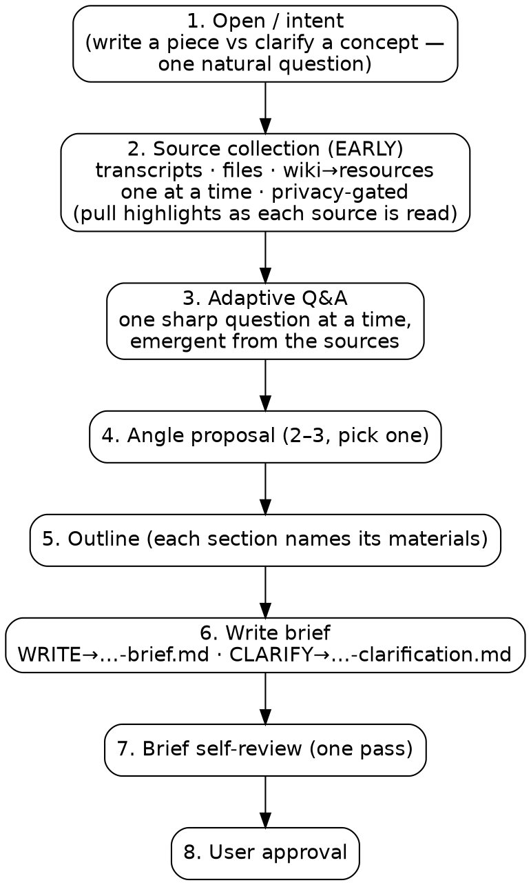

# Javis Brainstorming

Turn a vague writing request into a structured brief that captures intent, source materials, angle, and outline — ready for a separate drafting step. One early natural question splits *writing a piece for an audience* (WRITE) from *clarifying a concept for yourself* (CLARIFY); the only mechanical effect is which brief template is written at save time and whether the wiki reader is the primary or a supporting source stream.

The job is unchanged: read the Javis sources → ask smart emergent questions → propose an angle → outline → write the brief. Trust yourself to ask the right question, one at a time, from context — don't run a script.

## Process flow

Documentation only — the authoritative behavior is the phases and gates below. Eight phases, light-touch: only the sequence and the two hard gates are enforced. Note that source collection runs **early**, before the real questioning — reading the sources first is what powers sharp, specific questions.



<HARD-GATE>
Do NOT draft content (no paragraphs, no headlines, no lede, no prose of any kind) until a brief has been written to disk AND the user has approved it. The brief is the output. Drafting is a separate skill / separate prompt.
</HARD-GATE>

## Anti-Pattern: "I'll just draft a quick version"

Drafting before the brief is approved produces work that misses the audience, misuses sources, or buries the takeaway — and the user has to redo it. Every writing task goes through brief-first, no exceptions. The brief can be short for simple posts, but it MUST exist and be approved before any prose appears.

## Phases (run in order)

1. **Open / intent** — one natural question: *writing a piece for an audience* (WRITE) or *clarifying a concept for yourself* (CLARIFY)? Often inferable from what the user handed over. Not a machinery fork — a normal adaptive question. Its only effect: the brief template chosen in Phase 6, and whether the wiki reader is the primary or a supporting source stream.
2. **Source collection (EARLY)** — Javis transcripts + user files + Javis wiki→linked resources; read *first*, one at a time, privacy-gated. Pull highlights as each source is read. See `source-collection.md`.
3. **Adaptive Q&A** — one sharp question at a time, emergent from what the sources revealed; multiple-choice preferred, open-ended when better. Soft focus on purpose / audience / takeaway / tone / success, only where the sources left a gap.
4. **Angle proposal** — present 2–3 framings; the user picks one.
5. **Outline build** — sized to the format / clarification shape; each section names its supporting materials.
6. **Write brief** — WRITE → `briefs/YYYY-MM-DD-<slug>-brief.md`; CLARIFY → `briefs/YYYY-MM-DD-<slug>-clarification.md` (user's current working directory).
7. **Brief self-review** — one fresh-eyes pass over the saved brief (both brief types); fix issues inline.
8. **User approval** — the user reviews the brief; revise if requested.

## Adaptive questioning

Ask questions the way `superpowers/brainstorming` does — trust yourself to ask the right one from context:

- **One question at a time.** Ask, wait for the answer, then decide the next question from what you just learned. Never batch, never bundle multiple questions into one turn.
- **Prefer multiple choice when it helps.** When you can offer 2–4 concrete options that sharpen the user's thinking, do — on an `AskUserQuestion` surface (Claude Code CLI or Desktop app) call `AskUserQuestion` with a short `header` and substantive `options`; the tool supplies "Other" automatically. On a plain-text surface, render the options as a short Markdown list ending with "other (describe)", then stop and wait.
- **Open-ended is fine.** When the question is genuinely open, just ask it in plain prose. Don't force a menu onto an answer that wants to be free text.
- **Focus on purpose, constraints, and success** — plus audience, takeaway, and tone. This is a soft focus, not a checklist. Ask in any order, follow the thread.
- **Skip what the sources already answered.** If reading the transcripts, files, or wiki already settled a point, don't ask it again. The value of reading first is fewer, sharper questions.

The write/clarify distinction (Phase 1) is just the first of these adaptive questions, asked early because it changes the output artifact and the source strategy.

## Read sources first

Source collection (Phase 2) runs **before** the real questioning (Phase 3). Read the sources first to build context and dependencies; that context is what makes the questions specific rather than generic. Reading first was never the problem — a rigid march *after* reading was, and that march is gone.

## Phase 1 — Open / intent

Ask one natural question: is the user *writing a piece for an audience* (WRITE) or *clarifying a concept for themselves* (CLARIFY)? Often it's inferable from what they handed over (e.g. "clarify the HeyJavis value props" ⇒ CLARIFY) — in that case, confirm rather than interrogate. This is a normal adaptive question, not a branch fork. Its only mechanical effects:

- Which brief template is written in Phase 6 (`…-brief.md` vs `…-clarification.md`).
- Whether the Javis wiki → linked-resources reader is the **primary** source stream (CLARIFY) or **optional** research input (WRITE).

If it's genuinely ambiguous, ask; don't infer silently.

## Phase 2 — Source collection (runs early)

Move from intent to inputs before the real questioning. The skill collects from three streams:

1. **Javis voice data** via the bundled `javis-mcp` connector (`mcp__claude_ai_javis_mcp__*` tools).
2. **User-provided files / links** — images, PDFs, video references, web links, plain notes.
3. **Javis wiki → linked resources** — read a wiki page, then its linked source files **one at a time** (never batched), via the `javis-mcp` wiki tools. **Primary** stream for CLARIFY; optional research input for WRITE. Full one-by-one procedure (locate → read page → read each source with a per-source summary line → privacy gate) is in `source-collection.md`.

Full procedure, tool routing, privacy rule, and inventory format for all three streams are in `source-collection.md`. Load that file before starting this phase.

Source collection is transactional — each step is "I propose, you confirm" rather than a menu. The one-question-at-a-time rule still applies (never batch confirmations).

**Pull highlights as you read.** For each source, extract the reusable material *while reading it*, not as a separate downstream pass:

- **Quotes** (verbatim, ≤2 sentences, attributed by `session_id` or person)
- **Data points** (numbers, dates, named percentages, with source)
- **Scenes / moments** (a 1-line description, for video/audio)
- **Image content** (what the image shows that's worth referencing)

If a source produced no usable highlights, leave it in inventory but note it — context, not quotable material.

## Phase 3 — Adaptive Q&A

Now ask. Use the sources you just read to ask sharp, specific questions — one at a time, per the **Adaptive questioning** rules above. Multiple-choice preferred when concrete options sharpen the thinking; open-ended when the answer wants to be free text.

Keep a soft focus on **purpose / audience / takeaway / tone / success** — but ask only where the sources left a gap, in any order. If reading already settled a point, skip it. There is no fixed list of questions and no visible agenda; let the questions emerge from what the sources revealed.

## Phase 4 — Angle proposal

Present **2–3 candidate angles** for the piece. Each option states:
- The angle in 1 sentence
- The strongest supporting materials
- The tradeoff

On an `AskUserQuestion` surface (CLI or Desktop app), call `AskUserQuestion` with the angles as options plus your recommendation in the question text. On a plain-text surface, render as a short Markdown list ending with "other (describe)", then stop and wait.

The user picks one (or asks you to revise). Record the picked angle and proceed.

## Phase 5 — Outline build

Once an angle is picked, draft an outline sized to the chosen format — or, on CLARIFY, to the clarification-brief shape (see `format-guides.md` for the per-format and clarification outline shapes). Each outline section names which materials feed it.

If a section has no material, either pull more sources to fill it or cut the section. Do not invent material.

**Visual companion (optional, just-in-time).** If an outline or structure decision is genuinely clearer *shown* than *told*, you may offer the visual companion (`visual-companion.md`) — in its own separate message, only at the moment it helps. It rarely fires for briefs; never open with it, and never let it delay reaching the brief.

## Phase 6 — Write brief

Write the brief to `briefs/YYYY-MM-DD-<slug>-brief.md` in the user's current working directory. Create `briefs/` if absent. State the full path before writing.

If a brief at that path already exists, show the diff and confirm overwrite. Do not auto-overwrite.

### Brief structure (WRITE)

```markdown
# <Working title>

**Format:** report | article | news | blog | other
**Date:** YYYY-MM-DD
**Status:** Brief — ready for drafting

## Intent
- Audience:
- Purpose:
- Key takeaway:
- Tone/voice:
- Success criterion:

## Angle
<the chosen framing in 1–2 sentences>

## Materials Inventory

### Javis transcripts
- session_id: <id> — <one-line description> — <relevant excerpts/quotes>

### User-supplied sources
- <file/link/image> — <description> — <relevance>

### Extracted highlights
- Quote: "..." — source: <id>
- Data: <number/fact> — source: <id>
- Scene: <description> — source: <id>

## Outline
1. <Section title> — purpose — materials feeding it
2. ...

## Open questions
- <anything the user still needs to decide / sources still to gather>
```

### CLARIFY — concept-clarification brief

When the intent is CLARIFY, write instead to `briefs/YYYY-MM-DD-<slug>-clarification.md` (same overwrite-confirm rule). It is **local only — never call `wiki_ingest_tool` or otherwise write to the Javis wiki.** The clarification-brief template — working definition, why it matters, what it is NOT, sharpened framing, a materials inventory with a **Javis wiki** block plus a **linked sources (read one by one)** block, and open questions — is defined in the concept-clarification section of `format-guides.md`.

## Phase 7 — Brief self-review

After the brief is written to disk (Phase 6) and **before** showing it to the user (Phase 8), do one fresh-eyes review pass over the saved file. This applies to **both** brief types — the writing brief (`…-brief.md`) and the concept-clarification brief (`…-clarification.md`). Check for:

- **Placeholder scan.** Search the brief for `TBD`, `TODO`, unfilled `<…>` stubs, and vague filler ("various", "some", "several", "etc."). Every placeholder is either filled from the captured answers / sources or moved to **Open questions** as an explicit, named unknown.
- **Internal consistency.** The captured fields must not contradict each other — audience / purpose / key takeaway / angle / outline (WRITE), or goal / working definition / tension / success signal (CLARIFY). Reconcile any drift.
- **Scope.** Is this one focused brief, or has it quietly grown into two? If the material implies more than one piece / concept, say so and propose decomposition rather than shipping an overloaded brief.
- **Ambiguity.** Any requirement readable two ways → pick one reading, make it explicit in the brief, and note the discarded reading in **Open questions** if it still matters.

Fix issues **inline** in the saved file. This is a single pass — **no re-review loop**. Once the brief comes out clean, proceed to Phase 8.

## Phase 8 — User approval

Tell the user the file is written and ask for review:

> "Brief saved to `<path>`. Please review it and let me know if you want to revise any section before handing this off to drafting."

If the user requests changes, edit the brief on disk. Once they approve, the skill is done. The terminal state is a saved, approved brief — **the skill does not draft prose**.

## Key Principles

- **One question per turn.** Always. No exceptions. Never batch.
- **Read the sources first.** Context before questioning — that's what makes the questions sharp.
- **The brief is the output.** Do not draft prose. Do not write headlines or ledes "to make it concrete."
- **Inventory before angle.** You can't pick a framing without knowing what materials support it.
- **Privacy.** Confirm before pulling any Javis transcript the user did not explicitly name. See `source-collection.md`.
- **Materials feed sections.** Every outline section names which sources support it. If a section has no material, either find one or cut the section.
- **YAGNI on scope.** If the user wants a 400-word blog post, don't propose a 6-section feature article.

## Loading detail

- Reference for brief/outline shapes — per-format outline shapes (WRITE) and the concept-clarification brief template (CLARIFY) → `format-guides.md`
- How to pull from `javis_mcp` tools, intake user files, and run the wiki → linked-resources one-by-one reader → `source-collection.md`
- Optional visual mockup of an outline / structure, offered just-in-time in its own message → `visual-companion.md`

Load these only when you reach the relevant phase — keep this SKILL.md focused on the flow.
