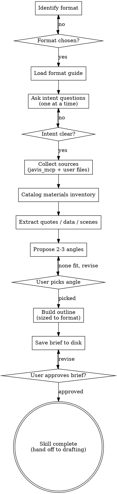

# Content Brainstorming

Turn a vague writing request into a structured brief that captures intent, source materials, angle, and outline — ready for a separate drafting step.

<HARD-GATE>
Do NOT draft content (no paragraphs, no headlines, no lede, no prose of any kind) until a brief has been written to disk AND the user has approved it. The brief is the output. Drafting is a separate skill / separate prompt.
</HARD-GATE>

## Anti-Pattern: "I'll just draft a quick version"

Drafting before the brief is approved produces work that misses the audience, misuses sources, or buries the takeaway — and the user has to redo it. Every writing task goes through brief-first, no exceptions. The brief can be short for simple posts, but it MUST exist and be approved before any prose appears.

## Checklist

You MUST create a task for each of these items and complete them in order:

1. **Identify format** — report / article / news / blog / other
2. **Clarify intent** — audience, purpose, key takeaway, tone (one question at a time)
3. **Collect source materials** — Javis transcripts via `mcp__claude_ai_javis_mcp__*` tools + user-provided files (see `source-collection.md`)
4. **Extract relevant facts** — quotes, data, scenes, captions per source
5. **Propose 2–3 angles** — with supporting materials + tradeoffs + a recommendation
6. **Build outline** — sized to the format; each section lists which materials feed it
7. **Save brief** — write to `briefs/YYYY-MM-DD-<slug>-brief.md` in the user's current working directory; state the path before writing
8. **Get user approval** — ask the user to review the brief; revise if requested; only then is the skill done

## Process Flow



**The terminal state is a saved, approved brief.** The skill does NOT draft prose. The next step (a drafting skill or direct user prompt) consumes the brief.

## Brief File Structure

Save to `briefs/YYYY-MM-DD-<slug>-brief.md` in the user's current working directory. Create `briefs/` if absent. State the full path before writing.

```markdown
# <Working title>

**Format:** report | article | news | blog | other
**Date:** YYYY-MM-DD
**Status:** Brief — ready for drafting

## Intent
- Audience:
- Purpose:
- Key takeaway:
- Tone/voice:

## Angle
<the chosen framing in 1–2 sentences>

## Materials Inventory

### Javis transcripts
- session_id: <id> — <one-line description> — <relevant excerpts/quotes>

### User-supplied sources
- <file/link/image> — <description> — <relevance>

### Extracted highlights
- Quote: "..." — source: <id>
- Data: <number/fact> — source: <id>
- Scene: <description> — source: <id>

## Outline
1. <Section title> — purpose — materials feeding it
2. ...

## Open questions
- <anything the user still needs to decide / sources still to gather>
```

## Key Principles

- **One question at a time.** Don't stack questions in a single message.
- **Multiple choice preferred.** Easier to answer than open-ended.
- **The brief is the output.** Do not draft prose. Do not write headlines or ledes "to make it concrete."
- **Inventory before angle.** You can't pick a framing without knowing what materials support it.
- **Privacy.** Confirm before pulling any Javis transcript the user did not explicitly name. See `source-collection.md`.
- **Materials feed sections.** Every outline section names which sources support it. If a section has no material, either find one or cut the section.
- **YAGNI on scope.** If the user wants a 400-word blog post, don't propose a 6-section feature article.

## Loading Detail

- Per-format question banks and outline shapes → `format-guides.md`
- How to pull from `javis_mcp` tools and intake user files → `source-collection.md`

Load these only when you reach the relevant step — keep this SKILL.md short.
