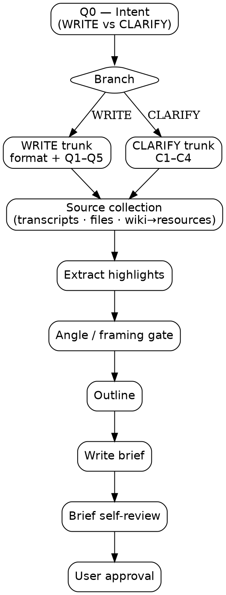

# Javis Brainstorming

Turn a vague writing request into a structured brief that captures intent, source materials, angle, and outline — ready for a separate drafting step. A top-level intent question first splits *writing a piece for an audience* (WRITE) from *clarifying a concept for yourself* (CLARIFY); each branch runs its own trunk and produces its own brief type.

## Process flow

Documentation only — the authoritative behavior is the phases and gates below. Both branches converge on the same source → highlights → framing → outline → brief → self-review → approval spine.



<HARD-GATE>
Do NOT draft content (no paragraphs, no headlines, no lede, no prose of any kind) until a brief has been written to disk AND the user has approved it. The brief is the output. Drafting is a separate skill / separate prompt.
</HARD-GATE>

## Anti-Pattern: "I'll just draft a quick version"

Drafting before the brief is approved produces work that misses the audience, misuses sources, or buries the takeaway — and the user has to redo it. Every writing task goes through brief-first, no exceptions. The brief can be short for simple posts, but it MUST exist and be approved before any prose appears.

## Phases (run in order)

0. **Intent** — Q0-Intent (WRITE = writing a piece for an audience · CLARIFY = clarifying a concept for yourself), asked first with the open → MC loop. Selects the branch.
1. **Format identification (WRITE branch only)** — Q0 format with open → MC loop. CLARIFY skips this phase entirely.
2. **Adaptive intent Q&A** — WRITE: Q1–Q5 (plus a format-branch question after the format question); CLARIFY: C1–C4. One question at a time, with the per-question loop below.
3. **Source collection** — Javis transcripts + user files + Javis wiki→linked resources; see `source-collection.md`
4. **Extract highlights** — quotes, data, scenes, captions per source
5. **Angle / framing proposal** — present 2–3 framings; user picks one
6. **Outline build** — sized to the format / clarification shape; each section names its supporting materials
7. **Write brief** — WRITE → `briefs/YYYY-MM-DD-<slug>-brief.md`; CLARIFY → `briefs/YYYY-MM-DD-<slug>-clarification.md` (user's current working directory)
7.5. **Brief self-review** — one fresh-eyes pass over the saved brief (both brief types); fix issues inline
8. **User approval** — the user reviews the brief; revise if requested

## Phase 2 — The per-question Q&A gate (the core mechanism)

<HARD-GATE>
You MUST execute Phase 2 (and Phase 0 / Phase 1 / Phase 5) as a per-question loop of **Steps A → B → C → D**.
You MUST NOT:
  - Ask more than one open question per turn.
  - Skip Step C (the MC refinement). Every Step B answer is followed by an MC.
  - Combine multiple questions into one `AskUserQuestion` call.
  - Move to the next question without writing the Step D echo line.
In CLI mode (Claude Code), Step C MUST be an `AskUserQuestion` tool call. Plain-text MC lists in CLI mode are a violation of this gate.
</HARD-GATE>

### Per-question loop (Steps A → B → C → D)

For every question in the active flow — **Q0-Intent first**, then the branch-specific trunk (WRITE: Q0 format, the format-branch question, Q1, Q2, Q3, Q4, Q5 — in this order; CLARIFY: C1, C2, C3, C4 — in this order) — execute exactly these four steps:

```
Step A — OPEN:    Ask the question in plain prose. ONE question only. Wait.
Step B — RECEIVE: User replies in free text.
Step C — MC:      Build 3 a/b/c options that classify or refine the user's
                  Step B answer, each with a one-sentence description.
                  An "other (describe)" escape is always present.
                  AskUserQuestion surface (CLI or Desktop app): call AskUserQuestion
                  (one entry, 3 options; the tool adds "Other" automatically).
                  Plain-text surface (no AskUserQuestion): render as a Markdown list
                  ending with "d) other (describe)", then STOP and wait.
Step D — ECHO:    After the pick, write ONE line:
                  "Recorded: <field> = <chosen label>. Moving on."
                  Then immediately ask the next question's Step A.
```

### MC construction rule (Step C)

The a/b/c options MUST be derived from the user's Step B answer. Two flavors apply by question type:

- **Classification questions** (Q0-Intent, Q0 format, branch question, Q1 audience): MC options are interpretations of the user's free-text answer mapped onto the question's taxonomy.

  Example for Q1 (audience) — user says "people who run growing engineering teams" → MC is *not* a generic audience taxonomy; it's three flavored framings of that audience:
    - a) **Engineering managers (10–50 reports)** — Day-to-day people managers at scale-ups; care about hiring loops and 1:1 cadence.
    - b) **Directors / VPs of Engineering** — Sets org-wide strategy; cares about org design, headcount planning, and metrics that roll up.
    - c) **Engineering-curious founders** — Hands-on operators who manage the team because nobody else can; want practical heuristics.
    - d) other (describe)

- **Prose questions** (Q2 purpose, Q3 key takeaway, Q4 tone, Q5 success criterion, plus format-specific prose branches): MC options are sharper rephrasings of the user's claim — three crisper one-sentence versions plus "other (describe)".

  Example for Q3 (key takeaway) — user says "remote work is fine, you just have to be intentional" → MC:
    - a) **Mechanism takeaway** — Remote teams that codify decisions in writing outperform colocated teams that don't.
    - b) **Cost takeaway** — Remote work is cheap to start and expensive to half-do; pick one mode and invest in it.
    - c) **Counter-narrative takeaway** — The "return to office" debate is a proxy for a management capability gap, not a location problem.
    - d) other (describe)

**Note on "other (describe)" rendering:** the worked examples above show the plain-text-surface rendering shape (the "d)" option is written out manually). On an `AskUserQuestion` surface (CLI or Desktop app), do NOT write a manual "d) other (describe)" — `AskUserQuestion` provides "Other" automatically. Build options a/b/c only.

**"I don't know" / "skip" Step B answers:** if the user's Step B answer is "I don't know", "skip", or equivalent, build the MC with a single "none of the above (skip)" option in place of "other (describe)" and proceed. The loop must still execute Steps C and D — never short-circuit. Record `<unknown>` in the brief's Open Questions section.

### Render-dependence for Step C (CLI / Desktop / plain-text)

Step C — and every question step (Q0-Intent, Q0 format, the format-branch question, Q1–Q5, C1–C4, and the Phase 5 angle gate) — renders as a **pure function of the surface**. The underlying question, its MC options, and the Step D echo are identical across all three surfaces; only the rendering differs.

| Surface | `AskUserQuestion`? | Rendering |
|---|---|---|
| **Claude Code (CLI)** — native terminal widget | available | Terminal widget: `☐ Header`, question prose, numbered options with the `❯` cursor, dim wrapped descriptions, `Type something.` / `Chat about this` footer split by a rule. Build 3 substantive options; the tool supplies "Other" automatically. |
| **Claude Desktop app** — native cards | available | Same `AskUserQuestion` call, native card UI: rounded option cards with a radio indicator, the selected card highlighted, an "Other — type your own answer…" affordance. |
| **Plain-text surface** — Markdown fallback | not available | Fallback Markdown list ending with `d) other (describe)`, then a STOP gate (see below). This is the former "Desktop mode" branch. |

Both `AskUserQuestion` surfaces (CLI terminal widget and Desktop cards) use the **same tool call**: one `questions` entry per Step C, with 3 `options` (each with `label` + `description`) and a short `header` (e.g., "Intent", "Format", "Audience", "Takeaway", "Goal", "Tension"). The tool's 1–4 question and 2–4 option caps make bundling structurally impossible. "Other" is provided automatically — do not add it manually.

On the **plain-text surface** (no `AskUserQuestion`), render the MC as a Markdown list in this exact shape:<br>`Pick one:`<br>`- **a)** <label> — <description>`<br>`- **b)** <label> — <description>`<br>`- **c)** <label> — <description>`<br>`- **d)** other (describe)`<br>Immediately follow the list with a STOP gate: "Do not continue this turn until the user replies." Accept "a"/"b"/"c"/"d" or a free-text label match. "d" requires a follow-up free-text capture before Step D.

**Detection (unchanged):** check whether the `AskUserQuestion` tool is callable. If yes, you are on an `AskUserQuestion` surface — render surface-native (CLI terminal widget or Desktop cards; same call either way). If not, use the plain-text Markdown fallback. This is the same availability check the skill has always used; the plain-text fallback is what the earlier "Desktop mode (no `AskUserQuestion`)" rule described.

### Per-question task checklist

Create the **Q0-Intent** task first, before any branch tasks, using `TaskCreate`. After Q0-Intent's Step D, create the branch-specific task set:
- **WRITE →** Q0 (format), branch question (added after the format question's Step D, only if the format isn't `<unknown>`), Q1, Q2, Q3, Q4, Q5.
- **CLARIFY →** C1, C2, C3, C4 only (no format question, no branch question, no Q1–Q5).

Mark each task `in_progress` at Step A and `completed` at Step D. If a question becomes irrelevant mid-flow (rare), delete the task rather than silently ignoring it.

### Red-flag table (anti-patterns)

| Thought | Reality |
|---|---|
| "I'll ask Q0 and Q1 together since they're related" | One question per turn. Always. |
| "The user clearly meant 'blog' — I'll skip the MC and move on" | MC is mandatory. The user picks, not the assistant. |
| "I'll just write the a/b/c as bullets in CLI mode" | CLI mode = `AskUserQuestion`. No exceptions. |
| "The echo summary is verbose, I'll skip it" | The echo line is the seam between questions. Always emit it. |
| "User seems decisive, I'll skip Q4 (tone) for them" | Skip rules are inventory-driven only. User confidence is not a skip trigger. |
| "I'll combine 'approve the angle?' with the next question" | Phase 5 approval gates also apply one-at-a-time. |
| "Let me also propose a draft headline while I'm here" | Hard-gate violation. No prose until brief is approved. |

### The intent question and branch trunks

Q0-Intent is always asked first; its answer selects which trunk runs. The exact Step A prompts and MC option flavors — per format (WRITE) and per clarify-question (CLARIFY) — are defined in `format-guides.md`.

- **Q0-Intent — Intent (classification, asked first, before everything else).** Step A: "Are you writing a piece for an audience, or clarifying a concept for yourself?" MC: three options that interpret the user's Step B answer onto the **WRITE / CLARIFY** taxonomy (CLI: 3 options + Other automatic). After Step D: **WRITE →** ask the format question and the Q1–Q5 trunk below; **CLARIFY →** enter the C1–C4 trunk below and skip the format question and Q1–Q5 entirely.

**WRITE branch trunk (unchanged from v0.6.0) — always asked, in order:**

- **Q0 — Format.** Step A: "What are you writing — a report, article, news piece, blog post, or something else?" MC: report / article / news / blog / other (CLI: 3 options + Other automatic).
- **Branch question (asked immediately after Q0, before Q1).** One question whose content depends on Q0 — see `format-guides.md` per-format section.
- **Q1 — Audience.** Step A: "Who's reading this, and what do they already know about the topic?" Classification MC over a taxonomy customized by format.
- **Q2 — Purpose.** Step A: "What should the reader do, decide, or believe after reading this?" Prose MC (3 sharper rephrasings).
- **Q3 — Key takeaway.** Step A: "If the reader remembers one sentence from this, what is it?" Prose MC.
- **Q4 — Tone / voice.** Step A: "How should this sound — formal, conversational, urgent, reflective, something else?" Classification MC with 3 format-appropriate flavors.
- **Q5 — Success criterion.** Step A: "How will you know this piece worked? What's the signal you're looking for?" Prose MC.

**CLARIFY branch trunk — always asked, in order (concept-clarification; full Step A prompts and MC option flavors live in the concept-clarification section of `format-guides.md`):**

- **C1 — Goal (classification).** "What outcome do you want from clarifying this?" MC flavors all land on a local clarification brief: decide the real priority order / definition · understand it for myself · prep to explain it to others.
- **C2 — Current understanding (prose).** "What's your working definition right now?" MC = 3 sharper rephrasings of the user's answer.
- **C3 — Tension / ambiguity (prose).** "What's fuzzy, contested, or drifting about it?" MC = 3 sharpened framings of the tension.
- **C4 — Success criterion (prose).** "How will you know it's clarified?" MC = 3 sharper one-sentence versions.

The CLARIFY trunk uses the same A → B → C → D loop and the same render-dependence matrix (above), and its primary source stream is the Javis wiki → linked-resources reader (Phase 3, `source-collection.md`). Its output is a concept-clarification brief (`…-clarification.md`) — local only, never a wiki write (Phase 7).

### "Other (describe)" flags

When the user picks "other (describe)" on Q2, Q3, or Q5 (WRITE), or on C1, C3, or C4 (CLARIFY), record the field as `<user's free text>` but also set `<field>_flagged = true` in the brief. Each flag emits a `> Note: this section was kept open per user; revisit before publishing.` callout under the corresponding line in the brief.

### Edge cases

- User answers "I don't know" / "skip" → record `<unknown>`; still execute Step C with a "none of the above (skip)" option in place of "other (describe)"; still emit Step D.
- User answers "I don't know" to **Q0-Intent** → still execute Steps C and D; the branch cannot be inferred, so ask the user to pick WRITE or CLARIFY before creating any branch tasks (via `TaskCreate`). Do not default silently.
- User answers "I don't know" to Q0 (format, WRITE branch) → skip the branch question entirely; do NOT create a branch task (via `TaskCreate`); carry the unknown format through and ask the user to pick a structure later in source collection.
- "go back" / "change" on a CLARIFY-trunk question (C1–C4) → replay only the affected question, same as the WRITE trunk. Abort → no partial brief (either type).
- User says "change", "wait", "go back", or names a previous field → re-enter Step C of the affected question (or Step A if the open answer itself was wrong). Replay only the affected question, not the whole flow.
- User aborts → stop cleanly; do not write a partial brief.

## Phase 3 — Source collection

Move from intent to inputs. The skill collects from three streams:

1. **Javis voice data** via the bundled `javis-mcp` connector (`mcp__claude_ai_javis_mcp__*` tools).
2. **User-provided files / links** — images, PDFs, video references, web links, plain notes.
3. **Javis wiki → linked resources** — read a wiki page, then its linked source files **one at a time** (never batched), via the `javis-mcp` wiki tools. **Primary** stream for CLARIFY; optional research input for WRITE. Full one-by-one procedure (locate → read page → read each source with a per-source summary line → privacy gate) is in `source-collection.md`.

Full procedure, tool routing, privacy rule, and inventory format for all three streams are in `source-collection.md`. Load that file before starting Phase 3.

Source collection is more transactional than Phase 2 — each step is "I propose, you confirm" rather than open → MC. The one-question-at-a-time rule still applies (never batch confirmations).

## Phase 4 — Extract highlights

For each source, pull out:
- **Quotes** (verbatim, ≤2 sentences, attributed by `session_id` or person)
- **Data points** (numbers, dates, named percentages, with source)
- **Scenes / moments** (a 1-line description, for video/audio)
- **Image content** (what the image shows that's worth referencing)

If a source produced no usable highlights, leave it in inventory but note it — context, not quotable material.

## Phase 5 — Angle proposal (also uses the per-question gate)

Present **2–3 candidate angles** for the piece. Each option states:
- The angle in 1 sentence
- The strongest supporting materials
- The tradeoff

Use the Step C mechanism: on an `AskUserQuestion` surface (CLI or Desktop app), call `AskUserQuestion` with the angles as options + your recommendation in the question text. On the plain-text surface (no `AskUserQuestion`), render as a Markdown list ending with "d) other (describe)".

The user picks one (or asks you to revise). Record the picked angle. Then Step D and proceed.

## Phase 6 — Outline build

Once an angle is picked, draft an outline sized to the chosen format — or, on the CLARIFY branch, to the clarification-brief shape (see `format-guides.md` for the per-format and clarification outline shapes). Each outline section names which materials feed it.

If a section has no material, either pull more sources to fill it or cut the section. Do not invent material.

**Visual companion (optional, just-in-time).** If an outline or structure decision is genuinely clearer *shown* than *told*, you may offer the visual companion (`visual-companion.md`) — in its own separate message, only at the moment it helps. It rarely fires for briefs; never open with it, and never let it delay reaching the brief.

## Phase 7 — Save brief

Write the brief to `briefs/YYYY-MM-DD-<slug>-brief.md` in the user's current working directory. Create `briefs/` if absent. State the full path before writing.

If a brief at that path already exists, show the diff and confirm overwrite. Do not auto-overwrite.

### Brief structure

```markdown
# <Working title>

**Format:** report | article | news | blog | other
**Date:** YYYY-MM-DD
**Status:** Brief — ready for drafting

## Intent
- Audience:
- Purpose:
- Key takeaway:
- Tone/voice:
- Success criterion:

> Note: this section was kept open per user; revisit before publishing.
(emit the callout above only under any field whose *_flagged is true)

## Angle
<the chosen framing in 1–2 sentences>

## Materials Inventory

### Javis transcripts
- session_id: <id> — <one-line description> — <relevant excerpts/quotes>

### User-supplied sources
- <file/link/image> — <description> — <relevance>

### Extracted highlights
- Quote: "..." — source: <id>
- Data: <number/fact> — source: <id>
- Scene: <description> — source: <id>

## Outline
1. <Section title> — purpose — materials feeding it
2. ...

## Open questions
- <anything the user still needs to decide / sources still to gather>
```

### CLARIFY branch — concept-clarification brief

When the intent is CLARIFY, write instead to `briefs/YYYY-MM-DD-<slug>-clarification.md` (same overwrite-confirm rule). It is **local only — never call `wiki_ingest_tool` or otherwise write to the Javis wiki.** The clarification-brief template — working definition, why it matters, what it is NOT, sharpened framing, a materials inventory with a **Javis wiki** block plus a **linked sources (read one by one)** block, and open questions — is defined in the concept-clarification section of `format-guides.md`. Every clarify-trunk answer lands somewhere in it: C1→Goal / Sharpened framing, C2→Working definition, C3→What it is NOT + tension, C4→Success signal.

## Phase 7.5 — Brief self-review

After the brief is written to disk (Phase 7) and **before** showing it to the user (Phase 8), do one fresh-eyes review pass over the saved file. This applies to **both** brief types — the writing brief (`…-brief.md`) and the concept-clarification brief (`…-clarification.md`). Check for:

- **Placeholder scan.** Search the brief for `TBD`, `TODO`, unfilled `<…>` stubs, and vague filler ("various", "some", "several", "etc."). Every placeholder is either filled from the captured answers / sources or moved to **Open questions** as an explicit, named unknown.
- **Internal consistency.** The captured fields must not contradict each other — audience / purpose / key takeaway / angle / outline (WRITE), or goal / working definition / tension / success signal (CLARIFY). Reconcile any drift.
- **Scope.** Is this one focused brief, or has it quietly grown into two? If the material implies more than one piece / concept, say so and propose decomposition rather than shipping an overloaded brief.
- **Ambiguity.** Any requirement readable two ways → pick one reading, make it explicit in the brief, and note the discarded reading in **Open questions** if it still matters.

Fix issues **inline** in the saved file. This is a single pass — **no re-review loop**. Once the brief comes out clean, proceed to Phase 8.

## Phase 8 — User approval

Tell the user the file is written and ask for review:

> "Brief saved to `<path>`. Please review it and let me know if you want to revise any section before handing this off to drafting."

If the user requests changes, edit the brief on disk. Once they approve, the skill is done. The terminal state is a saved, approved brief — **the skill does not draft prose**.

## Key Principles

- **One question per turn.** Always. No exceptions.
- **Step C is mandatory.** Every open answer is followed by an MC refinement.
- **MC options are derived from the user's answer**, not generic taxonomy.
- **The brief is the output.** Do not draft prose. Do not write headlines or ledes "to make it concrete."
- **Inventory before angle.** You can't pick a framing without knowing what materials support it.
- **Privacy.** Confirm before pulling any Javis transcript the user did not explicitly name. See `source-collection.md`.
- **Materials feed sections.** Every outline section names which sources support it. If a section has no material, either find one or cut the section.
- **YAGNI on scope.** If the user wants a 400-word blog post, don't propose a 6-section feature article.

## Loading detail

- Per-format Step A prompts, MC option flavors, branch question, outline shapes (WRITE) → `format-guides.md`
- CLARIFY branch: C1–C4 Step A prompts, MC flavors, and the clarification-brief shape → `format-guides.md`
- How to pull from `javis_mcp` tools, intake user files, and run the wiki → linked-resources one-by-one reader → `source-collection.md`
- Optional visual mockup of an outline / structure, offered just-in-time in its own message → `visual-companion.md`

Load these only when you reach the relevant phase — keep this SKILL.md focused on the loop mechanism.
